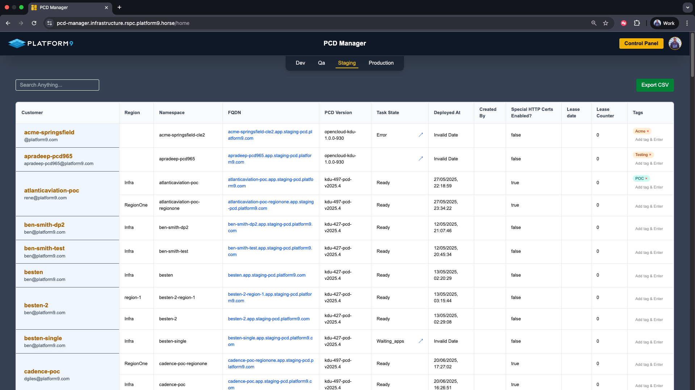
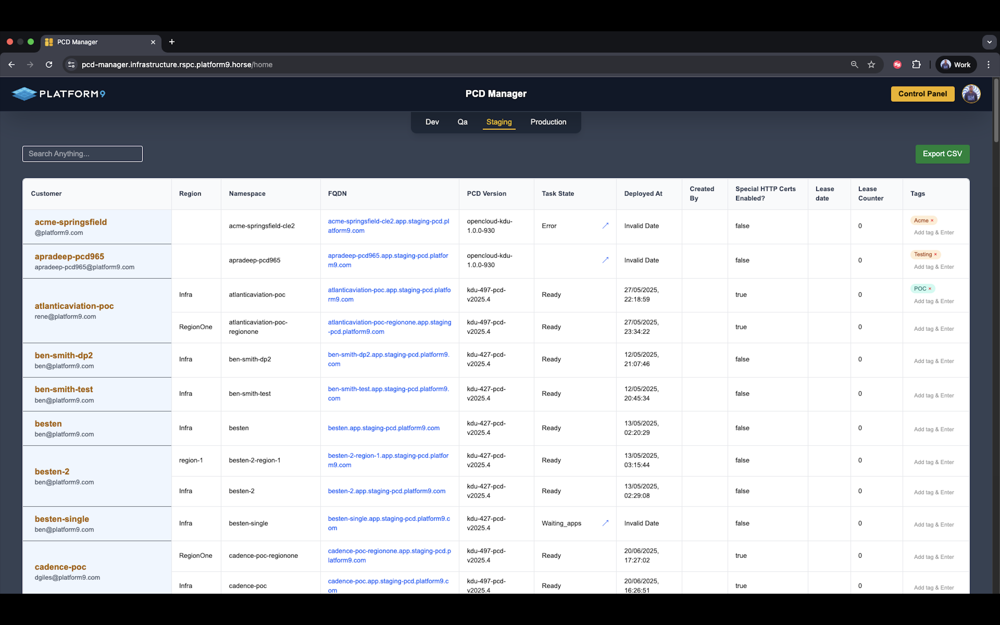

<link rel="stylesheet" href="assets/css/style.css">

# 🌩️ PCD Manager

> A dashboard to manage Private Cloud Directors (PCDs) across Infra and workload regions.

---

## 🔐 Authentication

- Google OAuth via NextAuth
- Restricted to internal Google accounts

---

## 📊 Home Page

- View all regions across environments
- Grouped by customer shortname
- Search by FQDN, owner, tags
- Reset `task_state` to `ready`
- Add or remove tags in real time

---

## 🛠️ Control Panel

- Create Infra region (new customer)
- Add workload region under existing PCD
- Update lease date, add notes
- Delete Infra or workload regions
- Navigate to Tempus Upgrade Page

---

## 🧹 Cleanup & Notifications

- Auto-delete expired regions using lease date
- Notify region owners via Slack alerts (7-day & 1-day reminders)
- Alerts posted to Slack Channel `#pcd-lease-notices`

---

## 📹 Demo

> (Video placeholder - replace with your actual demo)

---

## 🔧 Tech Stack

- **Frontend**: Next.js (App Router)
- **APIs**: `/app/api`, written in TypeScript
- **Auth**: Google OAuth with NextAuth
- **Messaging**: Slack Web API
- **Deployment**: Dockerized (standalone image)

---

## 📘 Glossary

| Term            | Description                                    |
| --------------- | ---------------------------------------------- |
| PCD             | Private Cloud Director — Managed OpenStack+K8s |
| Infra Region    | Root region tied to a SaaS/customer            |
| Workload Region | Child region under an Infra region             |
| Bork            | Internal metadata service used by PCD Manager  |
| Tempus          | Upgrade service used for region upgrades       |

---
